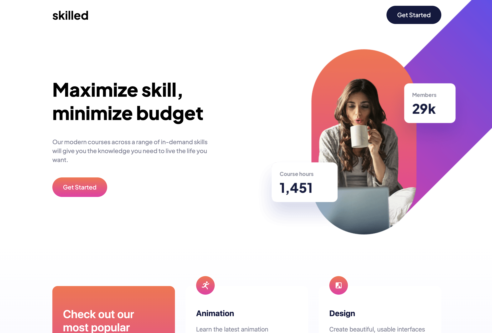

# Frontend Mentor - Skilled e-learning landing page

This is a solution to the [Skilled e-learning landing page challenge on Frontend Mentor](https://www.frontendmentor.io/challenges/skilled-elearning-landing-page-S1ObDrZ8q). Frontend Mentor challenges help you improve your coding skills by building realistic projects.

## Table of contents

- [Overview](#overview)
  - [Screenshot](#screenshot)
  - [Links](#links)
- [My process](#my-process)
  - [Built with](#built-with)
  - [What I learned](#what-i-learned)
- [Author](#author)

## Overview

### Screenshot

### Links

- [Solution LINK](https://www.frontendmentor.io/solutions/article-preview-component-hyR_AXEAdK)
- [Live Site LINK](https://alvaro-frontend-mentor-projects.github.io/skilled-e-learning-landing-page/)

## My process

### Built with

- Semantic HTML5 markup
- React
- Tailwind CSS
- Github Pages

### What I learned

## Author

- Website - [Portfolio](https://alvaroormeno.github.io/alvaro-portfolio-v1/)
- Frontend Mentor - [@alvaroormeno](https://www.frontendmentor.io/profile/alvaroormeno)
- Instagram - [@alvaroormeno](https://www.instagram.com/alvaroormeno/)